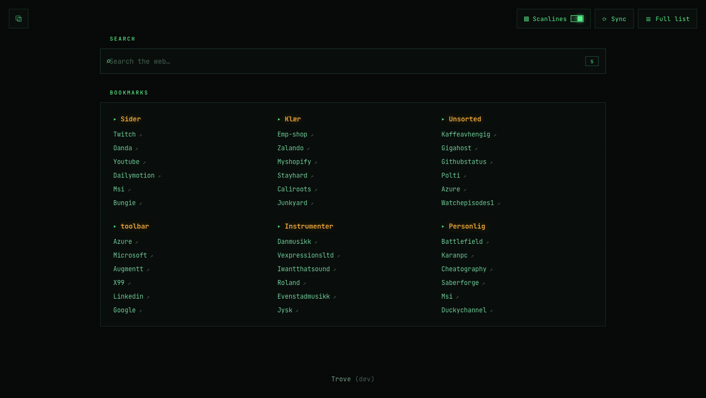
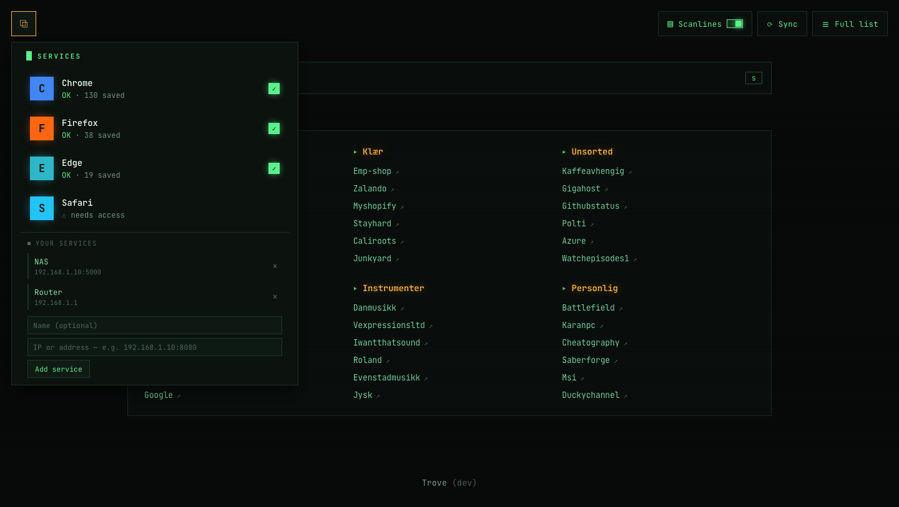
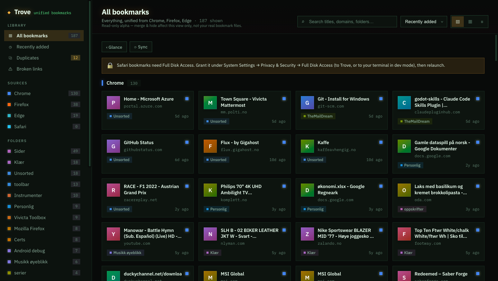

# Trove — Unified Cross-Browser Bookmark Dashboard

A dark, dev-tool-styled dashboard that unifies the bookmarks from **Chrome, Firefox, Edge
& Safari** on your Mac into one searchable view — with duplicate detection, live broken-link
triage, and folder/source filtering.

This is the real implementation of the [Claude Design](https://claude.ai/design) "Trove"
mockup, reading your actual browser bookmark stores. It runs three ways:

- **Desktop app (Electron)** — a single installable application. No background server; it
  re-scans all your browsers **every time it opens**.
- **Browser extension (new tab)** — the condensed view as your new-tab page in Chrome/Edge/Firefox.
  It syncs the unified, cross-browser data from the desktop app ("the helper") and caches it, so the
  new tab keeps working even after the helper stops. See [Browser extension](#browser-extension-new-tab-page).
- **Web / dev mode** — a local Node/Express server + Vite dev server, for developing the UI in a
  normal browser.

> **Alpha / read-only.** Trove reads your bookmark files but never writes to them. "Merge" and
> "Remove/Hide" actions affect the current view only — your browsers are untouched.

## Screenshots

Styled in the **Phosphor** theme — a retro arcade-terminal look (amber + phosphor-green on
near-black, solid brand-colored tiles, optional CRT scanlines).

**Condensed "Glance" view** — the default / new-tab page: a web-search bar, your top folders as
columns, and the toggleable scanlines.



**Services menu** — hover the top-left icon for your connected browsers (sync status + counts) and
your own custom IP/DNS services.



**Full dashboard** — the detailed grouped/grid/list view (duplicates, broken-link triage, search, sort).



## Architecture

```
electron/        Desktop app shell.
  main.cjs         main process: reads bookmarks on launch, serves the UI over IPC (no port)
  preload.cjs      contextBridge → window.trove { getBookmarks, checkLinks }
server/          Shared bookmark logic (Node). Reused by both the app and the dev server.
  core.js          snapshot + link-check-and-fold (used by Electron IPC and Express routes)
  parsers/         chromium.js (Chrome+Edge), firefox.js (places.sqlite), safari.js (plist)
  unify.js         merges sources into one model    dedupe.js  flags same-URL duplicates
  linkChecker.js   live HTTP reachability checks
  index.js         Express dev server (browser dev only; the app never starts it)
electron/
  helper.cjs       local HTTP server (127.0.0.1:4174) the browser extension reads from
extension/       MV3 browser extension (new-tab override). app/ is the built UI (generated).
web/             Vite + React UI. Picks its data source automatically:
                   window.trove IPC (app) · helper @127.0.0.1:4174 + cache (extension) · /api (dev)
```

The data contract (same shape over IPC and HTTP):
- `getBookmarks()` → `{ bookmarks, browsers, browserOrder, folders, stats, notices }`
- `checkLinks(ids?)` → runs live HTTP checks, returns the broken set

## Requirements

- **macOS** (bookmark paths are macOS-specific for now).
- **Node ≥ 22** for dev (the Firefox reader uses the built-in `node:sqlite`). Developed on Node 26.
  The packaged app bundles its own Node (Electron 42 → Node 24), so end users need nothing installed.

## Run as a desktop app

```bash
npm run install:all     # installs root + web dependencies
npm run app             # builds the UI and launches the Trove desktop app
```

Build an installable bundle:

```bash
npm run dist            # produces release/mac-arm64/Trove.app (+ a .dmg)
```

Then drag **Trove.app** to `/Applications`. Launching it re-scans your bookmarks each time.

> **Note (this repo lives in a OneDrive folder):** cloud-synced folders add extended attributes
> that macOS `codesign` rejects, so `npm run dist`'s signing/`.dmg` step can fail with
> *"resource fork … not allowed."* The `.app` is still built. Finish it with:
> ```bash
> xattr -cr "release/mac-arm64/Trove.app" && codesign --force --deep -s - "release/mac-arm64/Trove.app"
> ```
> Building from a non-synced folder (e.g. `~/Trove`) avoids this entirely.

## Run in the browser (dev mode)

```bash
npm run dev             # starts the Express backend (:4000) and Vite dev server (:5173)
```

Then open **http://localhost:5173**. The UI auto-detects it's in a browser and uses the HTTP API;
inside the desktop app it uses IPC instead — no code change either way.

## Browser extension (new-tab page)

Trove can take over your **new-tab page** in Chrome, Edge, and Firefox, showing the condensed
glance view. Because an extension's sandbox can't read *other* browsers' bookmark files, it gets
the unified cross-browser data from the **Trove desktop app acting as a local helper**:

1. **The desktop app is the helper.** On launch it does the cross-browser scan and starts a small
   local server on `http://127.0.0.1:4174`. The extension fetches from it and **caches the result**
   (in `chrome.storage`), so your new tab still renders after the helper stops.
2. **You decide what the helper does after syncing.** In the app's **services menu** (top-left icon)
   there's an *Extension helper* control: Start/Stop, and a *"Stop automatically after the browser
   syncs"* toggle. Off (default) = stays up while the app is open; On = shuts the server down a few
   seconds after the browser pulls data (the extension keeps showing the cached sync).

### Build & install

```bash
npm run ext:build       # builds the UI and assembles the loadable extension into extension/
```

- **Chrome / Edge:** `chrome://extensions` (or `edge://extensions`) → enable **Developer mode** →
  **Load unpacked** → select the `extension/` folder.
- **Firefox:** `about:debugging` → **This Firefox** → **Load Temporary Add-on** → pick
  `extension/manifest.json`. (Temporary add-ons are removed when Firefox restarts; permanent install
  needs signing via [AMO](https://addon.mozilla.org).)

Open the **Trove desktop app** at least once so the extension can sync, then open a new tab.
If the helper isn't running and there's no cached sync yet, the new tab explains how to sync.

> This is the unpacked/developer install. Publishing to the Chrome Web Store / Firefox AMO (so it
> installs with one click and auto-updates) is a packaging + review step, noted in the roadmap.

## Where bookmarks come from

| Browser | Source | Notes |
|---------|--------|-------|
| Chrome  | `~/Library/Application Support/Google/Chrome/*/Bookmarks` | JSON; all profiles |
| Edge    | `~/Library/Application Support/Microsoft Edge/*/Bookmarks` | same Chromium format |
| Firefox | `<profile>/places.sqlite` | copied to a temp file first (it's locked while Firefox runs) |
| Safari  | `~/Library/Safari/Bookmarks.plist` | binary plist — **needs Full Disk Access** |

Browsers that aren't installed are simply skipped.

### Granting Safari access (Full Disk Access)

macOS protects `~/Library/Safari`. To include Safari bookmarks, grant **Full Disk Access** to
whatever process reads them:

- **Desktop app:** grant it to **Trove.app**, then relaunch.
- **Dev mode:** grant it to your terminal (Terminal/iTerm/VS Code), then restart it and re-run `npm run dev`.

Steps: System Settings → Privacy & Security → **Full Disk Access** → add and enable the app.

Until then, the services menu shows "needs access" for Safari and the other three browsers load normally.

## Two views

Trove opens on a **condensed "glance" view** (Glance-style: monospace, near-black, Phosphor amber +
green) and keeps the detailed dashboard one click away:

- **Condensed view (default)** — a **web-search** bar (Enter searches the web, or jumps straight to a
  typed URL/host; press `s` to focus, `Esc` to clear) and your top folders as BOOKMARKS columns.
  - **Services menu** — hover (or focus) the icon in the **top-left** corner to reveal your connected
    browsers (sync status + counts) and to add your own **custom IP/DNS services**.
  - **Top-right controls** — **Scanlines** (toggle the CRT effect, persisted), **Sync** (re-scan),
    and **Full list** (open the full dashboard).
- **Full dashboard** — the detailed grouped/grid/list view below. Use **‹ Glance** (top of the
  content area) to return to the condensed view.

## Full-dashboard features

- **Three layouts** (top-right switcher): Grouped by browser · uniform Grid · compact List.
- **Sidebar filtering** — smart views (All / Recently added / Duplicates / Broken), per-browser
  sources, and folder filters, all with live counts.
- **Duplicate detection & merge** — same normalized URL saved in multiple browsers is grouped;
  "Merge → keep newest" collapses a set (in the current view).
- **Broken-link triage** — opening the Broken view runs live HTTP checks and flags unreachable
  bookmarks with real status codes (404 / DNS / timeout / SSL). Re-check or hide individually.
- **Search & sort** — by recency, oldest, title, most-visited, or domain.

## Roadmap (out of scope for this alpha)

- Writing changes back to the actual browser bookmark files.
- Code signing + notarization (so the `.app`/`.dmg` opens without a Gatekeeper prompt) and auto-update.
- Publishing the extension to the Chrome Web Store / Firefox AMO (one-click install + auto-update);
  today it's a developer/unpacked install.
- Windows / Linux bookmark paths and packaging.
- In-app settings (accent / density / card radius) — the CSS tokens are already in place.
